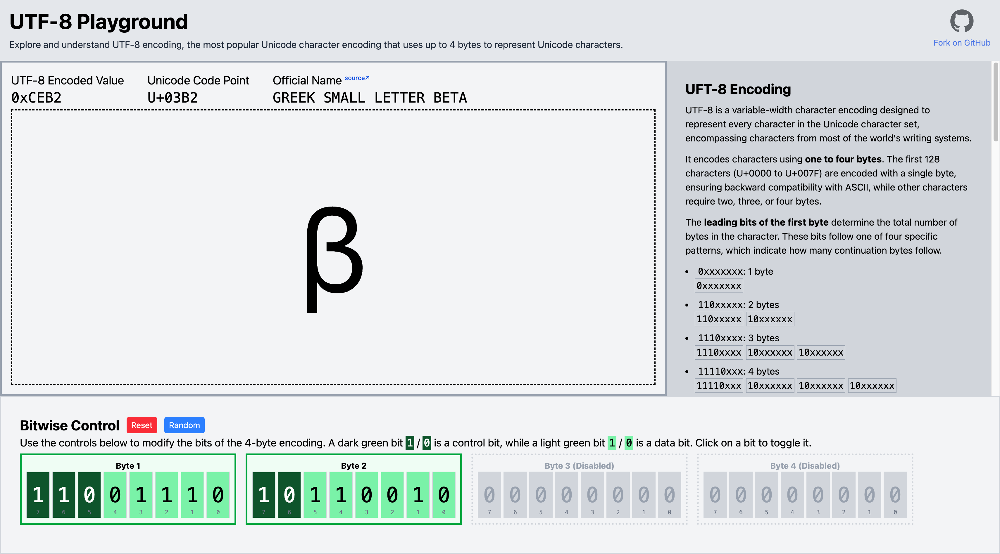

# UTF-8 Playground

UTF-8 Playground is a web-based tool designed to help developers and enthusiasts explore and experiment with UTF-8 encoding. It provides an interactive interface to visualize and understand how a character is encoded in UTF-8.



## Features

- Visualize bit-level representation of UTF-8 encoded characters.
- User-friendly interface for quick experimentation.
- A mini documentation on UTF-8 encoding.

## Getting Started

### Prerequisites

- Node.js (v14 or later)
- npm or yarn

### Installation

1. Clone the repository:
    ```bash
    git clone https://github.com/vishnuharidas/utf8-playground.git
    ```
2. Navigate to the project directory:
    ```bash
    cd utf8-playground
    ```
3. Install dependencies:
    ```bash
    npm install
    ```

### Running the Project

Start the development server:
```bash
npm start
```
The application will be available at `http://localhost:3000`.

## Contributing

Contributions are welcome! Please fork the repository and submit a pull request with your changes. Ensure your code follows the project's coding standards.

## Unicode Reference Data

Character names are sourced directly from the latest [UnicodeData.txt](
https://www.unicode.org/Public/UCD/latest/ucd/UnicodeData.txt) file, published by the Unicode Consortium.  

### Generate Unicode Data JSON
This project includes a utility script to fetch and process the latest Unicode character data from the official `UnicodeData.txt` and save it as a JSON file to use within the application.

#### Usage:

Run the script:

```shell
node utils/generate_unicode_lookup.js
```

This will:

 - Download the latest Unicode character data from unicode.org.
 - Process the data to extract code points and character names.
 - Save the result as unicode_data.json in the current directory.

Output
 - The script creates a file named `unicode_data.json` containing an array of objects:

```json
[
  { "code": "0020", "name": "SPACE" },
  { "code": "0021", "name": "EXCLAMATION MARK" },
  ...
]
```

This data is minified using a minifier tool like `jq` and then copied to `src/utf8/unicode_table.json`, where it is utilized by the application.

## License

Copyright (c) 2025 Vishnu Haridas

This software is published under MIT License. See [LICENSE.txt](LICENSE.txt) for more details